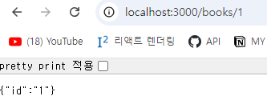

# 4주차-파트 1: 백엔드 기초: Node.js + Express 기본 (4)

수강 날짜: 2024년 9월 2일

## req.params 로 전달되는 데이터는 무조건 “문자열”

```jsx
app.get("/books/:id", function (req, res) {
    res.json({
        id: req.params.id,
    });
});
```



## 쿼리스트링

```jsx
app.get("/products", function (req, res) {
    // res.json(req.query); // req.query 는 자체가 JSON 형태

    const { name, price } = req.query; // 구조 분해 할당(destructuring)
    res.json({
        name, // name : name
        price, // price : price
    });
});

// localhost:3000/products?name=toy&price=20000
// {
//  "name": "toy",
//  "price": "20000"
// }
```

배열의 구조 분해 할당

```jsx
const arr = [1, 2, 3, 4, 5];
const [, num2, num3, , num5] = arr;

console.log(num2, num3, num5); // 2 3 5
```

## Youtube 실습

```jsx
const express = require("express");
const app = express();

app.get("/", function (req, res) {
    res.json("Hello World");
});

app.listen(3000);

const youtubers = new Map(); // Map 객체 사
youtubers.set("@syukaworld", {
    channelTitle: "슈카월드",
    subscriptors: "336만명",
    videoCount: "1.7천개",
});
youtubers.set("@codingapple", {
    channelTitle: "코딩애플",
    subscriptors: "30만명",
    videoCount: "227개",
});
youtubers.set("@ZeroChoTV", {
    channelTitle: "ZeroCho TV",
    subscriptors: "4.33만명",
    videoCount: "1.3천개",
});

app.get("/:channel", function (req, res) {
    const { channel } = req.params;
    if (youtubers.has(channel)) {
        res.json(youtubers.get(channel));
    } else {
        res.status(404).send("Not Found Page");
    }
});
```


## 네이밍 컨벤션

-   폴더, 파일 : kebab-case, snake_case
-   변수, 함수 : camelCase
-   클래스, 생성자 함수 : PascalCase
-   대문자 상수 : SNAKE_CASE

## Map 객체

Map 객체는 key 값으로 숫자와 문자를 구분함!

```jsx
const db = new Map();
db.set(1, "Number");
db.set("1", "String");

console.log(db.get(1)); // Number
console.log(db.get("1")); // String
```
