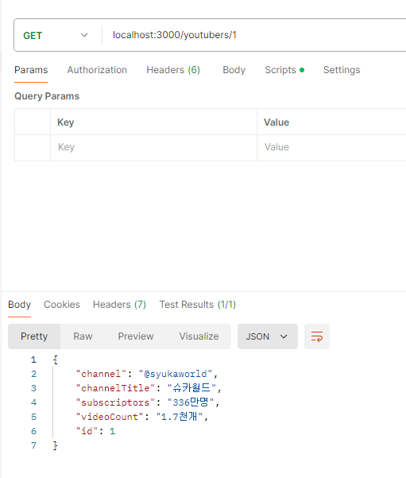
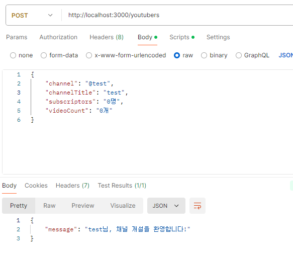
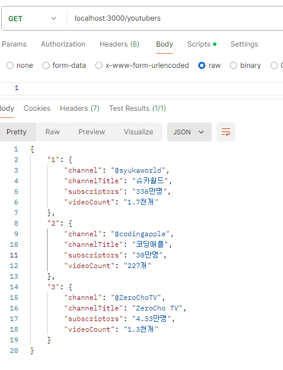

# 4주차-파트 1: 백엔드 기초: Node.js + Express 기본 (6)

수강 날짜: 2024년 9월 4일

## Postman

웹 브라우저에서는 Post 요청을 테스트할 수 없기 때문에 Postman 이라는 프로그램을 사용해서 테스트할 수 있다.

### GET



### POST

`req.body` 를 통해 post 요청 바디에 전달된 데이터를 보려면 `express.json()` 미들웨어를 `app`에 등록해야 한다.


## 유튜버 등록 실습




```jsx
const express = require("express");
const app = express();
app.listen(3000);
app.use(express.json());

const youtubers = new Map();
let id = 0;

youtubers.set(++id, {
    channel: "@syukaworld",
    channelTitle: "슈카월드",
    subscriptors: "336만명",
    videoCount: "1.7천개",
});
youtubers.set(++id, {
    channel: "@codingapple",
    channelTitle: "코딩애플",
    subscriptors: "30만명",
    videoCount: "227개",
});
youtubers.set(++id, {
    channel: "@ZeroChoTV",
    channelTitle: "ZeroCho TV",
    subscriptors: "4.33만명",
    videoCount: "1.3천개",
});

app.get("/", (req, res) => {
    res.json("Hello World");
});

app.get("/youtubers", (req, res) => {
    res.json(Object.fromEntries(youtubers)); // Map -> Object
});

app.get("/youtubers/:id", (req, res) => {
    const id = +req.params.id;
    if (youtubers.has(id)) {
        const youtuber = youtubers.get(id);
        res.json(youtuber);
    } else {
        res.status(404).send("해당 유튜버를 찾을 수 없습니다.");
    }
});

app.post("/youtubers", (req, res) => {
    youtubers.set(++id, req.body);
    res.json({
        message: `${req.body.channelTitle}님, 채널 개설을 환영합니다!`,
    });
});
```


