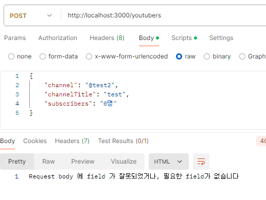

# 4주차-파트 1: 백엔드 기초: Node.js + Express 기본 (8)

수강 날짜: 2024년 9월 6일

## `==` vs `===`

-   `==` (동등 비교 연산자) : 비교하려는 피연산자의 자료형이 서로 다를 경우 암묵적으로 형변환일 일어남
-   `===` (일치 비교 연산자) : 비교하려는 피연산자의 자료형이 서로 달라도 형변환이 일어나지 않음

## 예외 고도화 : POST

`400 (Bad Request)` : 클라이언트가 잘못된 요청을 보냈을 경우

```
const youtubers = new Map();
const fields = JSON.stringify(["channel", "channelTitle", "subscribers", "videoCount"]);

app.post("/youtubers", (req, res) => {
    const reqFields = JSON.stringify(Object.keys(req.body));
    if (fields === reqFields) {
        youtubers.set(++id, req.body);
        res.json({
            message: `${req.body.channelTitle}님, 채널 개설을 환영합니다!`,
        });
    } else {
        res.status(400).send("Request body 에 field 가 잘못되었거나, 필요한 field가 없습니다");
    }
});
```



## HTTP 상태 코드

-   2xx : 성공
    -   200 : 조회/수정/삭제 성공
    -   201 : 등록 성공
-   4xx : 클라이언트 잘못
    -   400 : 클라이언트가 잘못된 데이터를 전달함
    -   404 : 찾는 리소스가 없음
-   5xx : 서버 잘못
    -   500 : 서버가 크리티컬한 오류를 맞았을 때

## 유튜브 미니 프로젝트(?)

### 설계

**기능 요구사항**

```markdown
-   회원
    -   가입
    -   탈퇴
    -   개인 정보 수정
        채널 ( 1인당 최대 100개까지 생성 가능)
        -   생성
        -   삭제
        -   채널 정보 수정
        -   조회
```

**페이지**

-   로그인 : **POST /login**
    -   req : body (id, pw)
    -   res : `${name}님 환영합니다` → 메인페이지 (리다이렉트)
      <aside>
      💡
      
      로그인 시 데이터는 URL에 표시되면 안되는 민감한 정보이기 때문에 Body에 담아보내야한다. 따라서 GET 대신 POST 를 사용한다.
      
      [GET 요청은 body를 가질 수 없는 이유](https://www.notion.so/GET-body-60b203a0947f4d34aa747b97a1db86fa?pvs=21)
      
      </aside>

-   회원가입 : **POST /join**
    -   req : body(id, pw, name)
    -   res : `🎉${name}님 환영합니다🎉` → 로그인 페이지 (리다이렉트)
-   마이페이지 : **GET /users/:id**
    -   req : URL(id)
    -   res : id, name
    -   회원 탈퇴 : DELETE /users/:id
        -   req : URL(id)
        -   res : “`${name}님 아쉽지만 다음에 또 만나요 😢`” or 메인 페이지 (리다이렉트)

### 코드

**TypeScript**

```tsx
import express from "express";
const app = express();
app.listen(3000);
app.use(express.json());

interface User {
    id: string;
    pw: string;
    name: string;
}

const db = new Map<string, User>();
const requiredFields = JSON.stringify(["id", "pw", "name"]);

// 로그인
app.post("/login", (req, res) => {
    const { id }: User = req.body;
    const user = db.get(id);

    if (user) {
        res.json({
            ...db.get(id),
            message: `${user.name}님, 어서오세요`,
        });
    } else {
        res.status(404).send("해당 계정을 찾을 수 없습니다.");
    }
});

// 회원가입
app.post("/join", (req, res) => {
    const { id, name }: User = req.body;
    const fields = JSON.stringify(Object.keys(req.body));

    if (requiredFields === fields) {
        db.set(id, req.body);
        res.status(201).json({
            ...req.body,
            message: `${name}님 환영합니다!🎉`,
        });
    } else {
        res.status(400).send("잘못된 값을 입력하였습니다.");
    }
});

// 회원 개별 조회
app.get("/users/:id", (req, res) => {
    const id: string = req.params.id;
    const user = db.get(id);
    if (user) {
        res.json({
            id: user.id,
            name: user.name,
        });
    } else {
        res.status(404).send("존재하지 않는 id 입니다.");
    }
});

// 회원탈퇴
app.delete("/users/:id", (req, res) => {
    const id: string = req.params.id;
    const user = db.get(id);
    if (user) {
        db.delete(id);
        res.send(`${user.name}님 아쉽지만 다음에 또 만나요 😢`);
    } else {
        res.status(404).send("존재하지 않는 id 입니다.");
    }
});
```
