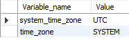
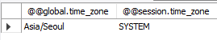
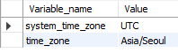
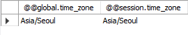

# 5주차-파트 5 백엔드 심화: 인증과 비동기처리(3)

수강 날짜: 2024년 9월 13일

## AUTO_INCREMENT

-   AUTO_INCREMENT 키워드를 사용하는 컬럼의 값을 직접 입력할 경우, 그 다음 값을 입력할 때는 해당 컬럼에서 가장 큰 값 +1 로 시작한다.
-   레코드를 삭제한다고 AUTO_INCREMENT 카운트가 줄진 않는다.
-   AUTO_INCREMENT 값을 초기화 하고 해당 컬럼의 값을 재조정하고 싶을 경우 다음과 같이 할 수 있다.
    ```sql
    ALTER TABLE 테이블명 AUTO_INCREMENT = 1; -- AUTO_INCREMENT 값 초기화
    SET @ COUNT = 0;
    UPDATE 테이블명 SET 컬럼명(AUTO_INCREMENT 설정한 컬럼) = @COUNT := @COUNT + 1;
    ```

## DB 연동 (with TypeScript)

```tsx
import mysql, { RowDataPacket } from "mysql2/promise";

interface User extends RowDataPacket {
    id: number;
    email: string;
    password: string;
    name: string;
    tel: string;
    created_at: Date;
}
const connection = await mysql.createConnection({
    host: "localhost",
    password: "root",
    user: "root",
    database: "Youtube",
});

try {
    const [results, fields] = await connection.query<RowDataPacket[]>(`SELECT * FROM users`);
    const { id, email, password, name, tel, created_at } = results[0] as User;
    console.log(id, email, password, name, tel, created_at);
    console.log(results);
    console.log(fields);
} catch (err) {
    console.log(err);
}
```

## Time Zone 설정

데이터베이스에 timestamp가 저장될 때는 데이터베이스의 system timezone 을 기준으로 시간이 저장된다. MySQL의 기본 system timezone은 UTC로 설정되어있다.

```sql
SHOW variables LIKE '%time_zone%'
```



이를 서버(Node.js) 에서 불러올 때는 서버 환경의 timezone에 맞춰 다시 날짜가 수정된다. 현재 서버는 한국에 있다. 한국은 UTC+9 이므로 데이터베이스에서 불러올 때 9시간을 뺀 날짜를 표시해준다 (왜 더하는게 아니라 빼는건지는 모르겠음)


UTC란 세계표준시를 말하며 글로벌 서비스를 만들 때는 해당 시간이 기준이 되어줄 수 있기 때문에 데이터베이스에 저장할 때는 UTC로 저장하는 것이 좋다. 하지만 지금은 실습을 위해 timezone 을 서울로 변경해보자.

```sql
SET GLOBAL time_zone = 'Asia/Seoul'; // 모든 데이터베이스에 적용하기 위해 GLOBAL 키워드 사용
```

하지만 여전히 데이터베이스 상에서 time_zone 의 값은 바뀌지 않았고 레코드의 시간도 변경되지 않았다. 그러나 Node.js 로 불러올 때는 시간이 변경되어 있는 모습을 확인할 수 있다.


그럼 데이터베이스의 시간도 동기화해주기 위해선 어떻게 해야 할까? 다음 쿼리를 실행시켜보자.

```sql
SELECT @@global.time_zone, @@session.time_zone;
```



global.time_zone 은 Asia/Seoul 로 설정된 걸 볼 수 있지만 session.time_zone 은 여전히 SYSTEM 으로 설정되어 있다. 여기서 session 이란 현재 접속중인 DB의 세션을 말한다. 현재 세션에서도 time_zone 을 변경시켜주기 위해 다음 쿼리를 실행시켜보자.

```sql
SET time_zone = 'Asia/Seoul'; // GLOBAL 키워드 제거
```

그랬더니 다음과 같이 현재 타임존에 맞게 시간이 변경된 것을 확인할 수 있었다. 그러나 Node.js 에서 조회했을 때는 이전과 달라지지 않은 것을 확인할 수 있다. 즉 Node.js 에서 조회할 때는 global.time_zone 변수의 영향을 받는다는 것을 알 수 있다.






## dateString

createConnection에 전달되는 객체의 dateString 프로퍼티를 true로 설정해주면 timestamp 조회 시 `YYYY-MM-DD HH:MM:SS` 형식의 문자열로 조회할 수 있다.

```tsx
const connection = await mysql.createConnection({
    host: "localhost",
    password: "root",
    user: "root",
    database: "Youtube",
    dateStrings: true,
});
```


또한 문자열로 변하면서 현재 서버의 타임존에 맞게 시간이 9시간 증가한 모습을 확인할 수 있다.

참고자료

---

https://velog.io/@ejayjeon/MYSQL-autoincrement-생성-추가-사용-등-정리
