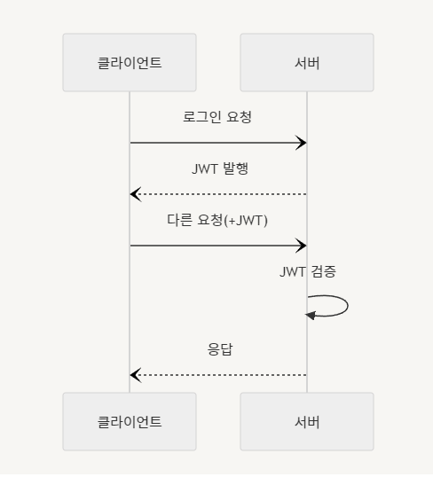

# 6주차-파트 3 백엔드 심화: 인증과 비동기처리(6)

수강 날짜: 2024년 9월 25일
태그: .env, Cookie, JWT, 로그인 세션, 인증 & 인가

## next()

express 의 get, post, delete, put 등의 메서드에 인수로 전달되는 콜백함수는 3개의 매개변수를 갖는다.

그 중 3번째 매개변수는 다음 미들웨어 함수를 호출하는 next() 함수다.

```tsx
function checkValidation(req: Request, res: Response, next: NextFunction) {
    const err = validationResult(req);
    if (err.isEmpty()) next(); // 조건은 부정문보다는 긍정문으로
    else return res.status(400).json(err.array());
}
```

## 로그인 세션 - 인증 & 인가

-   **👤 인증 (Authentication)**
    인증이란 가입된 사용자임을 ‘증명’ 하는 행위다.
-   **🛡️ 인가 (Authorization)**
    인가란 ‘권한을 부여’하는 항위다. ( 가입된 사용자라도 관리자와 고객은 각각 다른 권한이 부여되는 것처럼 )
-   **🍪 쿠키**
    쿠키란 웹에서 서버와 클라이언트가 주고 받는 데이터 중 하나로, 생성은 서버가 해서 클라이언트(브라우저)에게 주면, 브라우저가 자기 메모리에 이를 저장해두고 있다가 다음에 같은 서버에 방문할 때 해당 쿠키에 담긴 정보와 함께 요청을 한다.
    -   **장점**
        -   HTTP 의 특징 중 stateless 라는 것이 있다. 이는 서버가 상태를 저장하지 않는다는 의미인데, 쿠키를 사용하면 사용자가 서버에게 요청할 때 직접 쿠키와 함께 데이터를 전송하기 때문에 사용자의 상태를 서버가 저장하지 않아도 되므로 서버의 저장 공간을 절약할 수 있다.
            예를 들어 쿠키에 로그인 정보를 저장해두면 서버는 쿠키에 담긴 로그인 정보를 바탕으로 현재 로그인 된 사용자인지 판별 수 있다.
    -   **단점**
        -   보안에 취약하다.
-   **✨ 세션**
    세션이란 특정 상태를 의미한다. 즉, 로그인 세션이란 로그인이 되어 있는 상태를 말한다.
    세션은 상태를 서버에 저장한다. 그리고 해당 상태를 식별할 Id 를 만들어서 이를 쿠키에 담아 클라이언트와 주고받는다. 쿠키 자체에 데이터를 담아 전송하는 방식보다는 보안적인 측면에서 더 우수하다.
    -   장점
        -   보안이 비교적 좋다.
    -   단점
        -   서버의 저장 공간 사용한다.
        -   stateless 하지 않다.

## 🚀JWT (JSON Web Token)

JSON 형태의 데이터를 웹에서 토큰으로 사용하는 방식. 이러한 토큰을 인증 & 인가에 사용할 수 있다.

-   장점
    -   암호화되어있어 보안에 강하다.
    -   서버가 상태를 저장하지 않기 때문에 서버의 부담도 줄고 HTTP의 특징인 Stateless 도 잘 따른다.
-   구조
    -   헤더 : 메타데이터 ( 토큰을 암호화하는 데 사용한 알고리즘, 토큰의 형태 … )
    -   페이로드 : 실제 데이터
    -   서명 : 데이터가 변조되면 데이터와 함께 전달된 서명키도 변경되기 때문에 데이터의 위/변조를 방지할 수 있다.
-   절차

    

-   사용법
    -   npm에서 JWT 설치
        ```
        npm i jsonwebtoken
        ```
    -   서명
        **`jwt.sign(payload, secretOrPrivateKey, [options, callback])`**
        서명을 위해서는 **페이로드**와 **키 값**이 필요하다. (암호화 알고리즘은 SHA256이 기본적으로 설정되어 있다.)
        ```tsx
        var jwt = require("jsonwebtoken");
        var token = jwt.sign({ foo: "bar" }, "shhhhh");
        ```
    -   검증
        **`jwt.verify(token, secretOrPublicKey, [options, callback])`**
        검증을 위해서는 **토큰**과 서명 시 사용한 **키 값**이 필요하다.
        ```tsx
        var decoded = jwt.verify(token, "shhhhh");
        console.log(decoded.foo); // bar
        ```

## 유튜브 프로젝트에 JWT 적용시켜보기

-   **token 을 Header에 담아 보내기**
    ```tsx
    // 로그인
    router.post(
        "/login",
        body("email").notEmpty().isEmail().withMessage("이메일 입력 필요"),
        body("password").notEmpty().isString().withMessage("비밀번호 입력 필요"),
        checkValidation,
        async (req: Request, res: Response) => {
            try {
                const { email, password }: User = req.body;
                const sql = "SELECT * FROM `users` WHERE `email`= ? AND `password`= ?";
                const values = [email, password];
                const [results] = await mariadb.query<RowDataPacket[]>(sql, values);
                const loginUser = results[0];
                if (loginUser) {
                    const payload = { ...loginUser };
                    const token = jwt.sign(payload, privateKey);
                    res.setHeader("Access-Token", token);
                    res.send(`${loginUser.name}님, 환영합니다`);
                } else res.status(400).send("아이디 또는 패스워드를 확인해주세요");
            } catch (e) {
                const err = e as Error;
                res.status(404).json(err);
            }
        },
    );
    ```
-   **token 을 Cookie 에 담아 보내기**

    ```tsx
     ...
     res.cookie("token", token);
     ...
    ```

      <aside>
      💡
      
      클라이언트가 권한이 없는 요청을 전송한 경우 403 Forbidden 에러
      
      </aside>

-   **토큰 유효기간 설정 및 쿠키 설정**
    ```jsx
    ...
    const options = {
        expiresIn: "30m",
        issuer: "JaeHyeok",
    };
    const token = jwt.sign(payload, privateKey, options);
    res.cookie("token", token, { httpOnly: true });
    ...
    ```
    -   유효기간 설정 : 30분
    -   토큰 발행자 이름 설정 : “JaeHyeok”
    -   쿠키 설정 : HttpOnly
-   **Request 에 전달된 Cookie 읽기**

    ```
    npm install cookie-parser
    ```

    ```jsx
    var express = require("express");
    var cookieParser = require("cookie-parser");

    var app = express();
    app.use(cookieParser());

    app.get("/", function (req, res) {
        // Cookies that have not been signed
        console.log("Cookies: ", req.cookies);

        // Cookies that have been signed
        console.log("Signed Cookies: ", req.signedCookies);
    });

    app.listen(8080);
    ```

### Cookie 설정


-   `HttpOnly` : 쿠키는 클라이언트(브라우저)에서 자바스크립트로 조회할 수 있기 때문에 XSS(Cross Site Scripting)공격에 취약하다.
    
    HttpOnly 를 설정해주면 브라우저에서 쿠키에 접근할 수 없도록 제한할 수 있다.
-   `Secure` : HttpOnly 를 사용하여 클라이언트에서 JavaScript 를 통한 쿠키 탈취 문제는 예방할 수 있었으나, 여전히 JavaScript 가 아닌 네트워크를 직접 감청하여 쿠키를 가로챌 수 있는 가능성은 남아있다.
    이러한 통신상의 유출을 막기 위해 HTTPS 프로토콜을 사용하여 데이터를 암호한다. 그러나 개발자의 부주의로 인해 HTTP를 통해 데이터를 유출할 가능성이 있기 때문에 Secure 을 사용한다. Secure 설정을 해주면 HTTPS가 아닌 통신에서는 쿠키를 전송하지 않는다.

## .env

외부로 유출되면 안되는 설정값을 작성하는 파일

```
키_값 = 값 # 주석
```

.evn 파일에서는 데이터를 키-값 쌍으로 저장하며, 키는 대문자 스네이크 케이스(SNAKE_CASE)를 사용하고, 주석은 ‘#’ 을 이용해서 작성할 수 있다.

1. **dotenv 패키지를 이용해서 사용하는 법**

    ```
    npm i dotenv
    ```

    ```jsx
    const dotenv = require("dotenv");
    dotenv.config();

    console.log(process.env.키_값);
    ```

2. **node.js 실행 옵션을 사용하는 방법**

    .env 파일 생성 후 `node --env-file={환경 변수 파일명} {실행시킬 파일명}` 형식으로 JavaScript **파일을 실행**하면 끝.

    ```
    node --env-file=.env app.js
    ```

    매번 옵션을 입력하기 귀찮으니 **`package.json` 파일을 통해 명령어를 설정**해주면 `npm start` 명령어를 이용해서 쉽게 사용할 수 있다.

    (`package.json` 파일은 `npm init` 명령어를 통해 생성 가능하다.)

    ```json
    // package.json
    {
      ...
      "scripts": {
          "start": "node --env-file=.env"
      },
      ...
    }
    ```

    위와 같이 설정했다면 다음 명령어로 파일을 실행시킬 수 있다.

    ```
    npm start app.js
    ```

### 참고자료

---

https://velog.io/@rlfrkdms1/쿠키와-세션의-동작-원리와-세션의-구조

https://jwt.io/

https://www.npmjs.com/package/jsonwebtoken

https://www.npmjs.com/package/dotenv

https://nodejs.org/en/learn/command-line/how-to-read-environment-variables-from-nodejs

https://expressjs.com/en/resources/middleware/cookie-parser.html

https://nsinc.tistory.com/121
